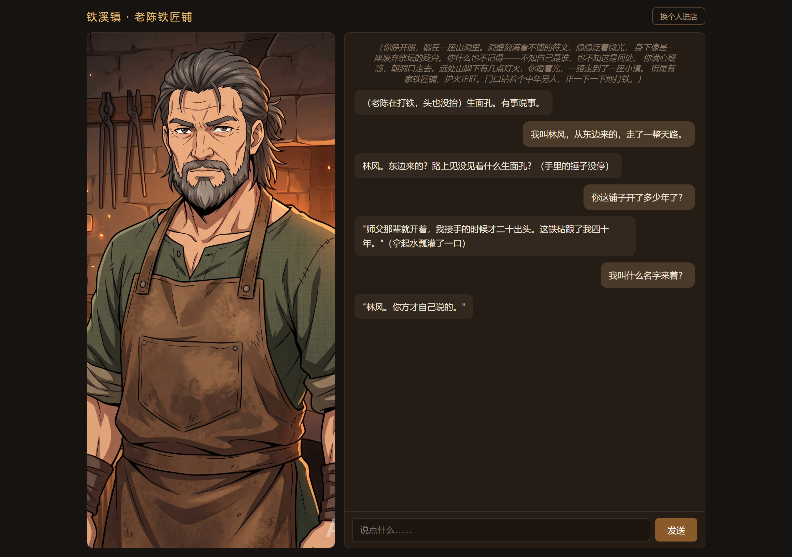
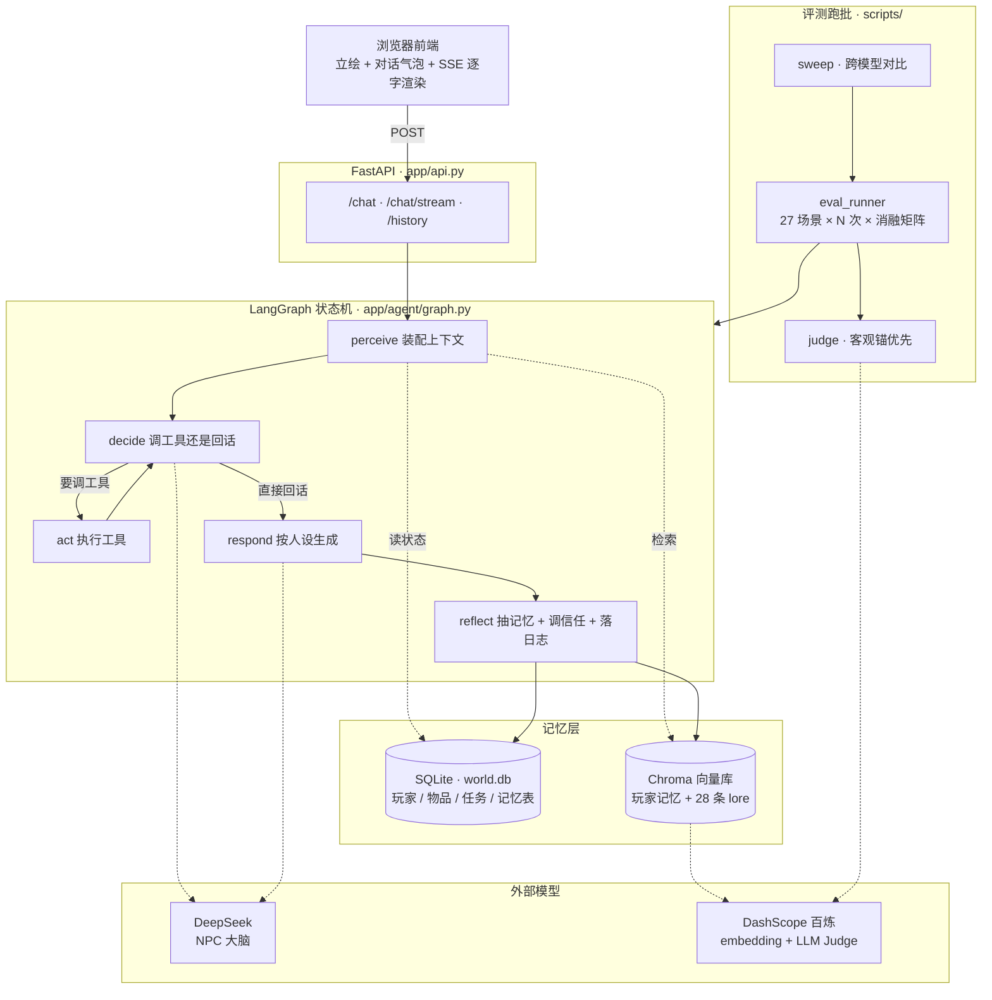

# Mnemosyne · 老陈铁匠铺

一个带**长期记忆**和**自我评测闭环**的 NPC Agent。你扮演一个失忆的转生者，走进边境小镇的铁匠铺，和铁匠老陈（陈铁山）说话——他记得你上次说过什么、叫什么名字、住哪；你砍价他会不客气，你打听学徒阿福他会一层层才肯说。

名字取自记忆女神 Mnemosyne。项目解决的问题：**让 LLM NPC 真正"记得住人"，并且这件事能被量化验证。**

> - **三层记忆 + 反思抽取**：工作记忆 / 长期记忆（向量检索 + 时间衰减 + 重要性加权）/ 摘要层；事实抽取走独立的反思调用，改口自动覆盖旧版本
> - **27 场景 × 5 桶自动化评测**：记忆 / 多轮一致 / 工具调用 / 目标推进 / 人设，每场景重复 3 次
> - **消融实验定位关键模块**：5 个配置逐个拨开关，300 runs 锁定"反思抽取"是长期记忆的必要条件（关掉后 A 桶 89% → 50%）
> - **跨 3 家厂商复跑**：243 runs，总通过率 93.8%–96.3%，差 2.5 个百分点 —— 记忆机制不绑模型
> - **LLM 判官经人校准**：54 条人工盲标，判官与标注完全一致
>
> [快速开始](#快速开始) ｜ [评测结果](#评测结果)



> 截图：左边立绘、右边对话。三轮对话——玩家报上名字，第三轮回头问"我叫什么"，老陈答"林风。你方才自己说的。"

---

## 与常见方案的区别

- **每轮走完整链路**。老陈的每轮回复要经过「查记忆 → 查世界状态 → 决定调不调工具 → 执行工具 → 组织语言 → 反思写库」六个环节。
- **记忆是会变的**。你改名，旧名字自动失效；你三天不来，记忆按时间衰减降权。这是"人的记忆"，不是"文档检索"。
- **只做一件事**——一个有记忆的 NPC，做到能被评测。

---

## 系统架构



三条主线：

- **对话**（`UI → API → LangGraph → 记忆层`）：每轮现查记忆和世界状态，不靠缓存。
- **记忆写入**（`reflect → 记忆表 + 向量库`）：对话结束后异步抽取事实落库，下轮即可检索到。
- **评测**（`eval_runner → 状态机 + Judge`）：直接驱动同一套图跑场景，判据能写断言的绝不交模型。

---

## 核心机制

### 三层记忆

| 层 | 存什么 | 怎么用 |
|---|---|---|
| **工作记忆** | 最近 8 条对话原文 | 每轮直接拼进 prompt，治"说完就忘" |
| **长期记忆** | 从对话里抽取的事实（名字 / 住处 / 喜好 / 承诺 / 线索） | Chroma 向量检索 + 时间衰减 + 重要性加权 |
| **摘要层** | 每 5 轮把旧摘要和这段对话重压成一段 ≤200 字的备忘 | 同 key 覆盖，滚雪球式压缩长会话 |

长期记忆的两个关键设计：

- **同 key 覆盖（supersede）**：玩家改口说"我改叫李四"，新记忆写入、旧记忆 `is_active` 置 False 自动沉底。不用删，但检索不到。
- **反思抽取**：每轮对话结束，另一个 LLM 调用把"值得长期记住的事实"抽成 JSON 写库。这是长期记忆的**必要条件**——消融实验证明关掉它就等于失忆（见下文）。

### ReAct 回环

```
START → perceive → decide ──要调工具──▶ act ──结果回灌──▶ decide
                     └──直接回复──▶ respond → reflect → END
```

- `perceive` 装配上下文：世界快照 + 玩家记忆 + 本轮相关 lore
- `decide` 带 6 个工具的说明书，判断"调工具还是直接说话"
- `act` 执行并回灌结果，回到 `decide` 再判断一轮（防死循环：单轮最多 3 次、同一工具不重复）
- `respond` 按人设生成台词，**流式逐字推给前端**
- `reflect` 抽取新记忆写库 + 规则引擎调整信任值 + 落运行日志

### 自我评测闭环

27 个场景分 5 桶，每场景重复 3 次（共 81 runs）：

| 桶 | 数量 | 考什么 | 判法 |
|---|---|---|---|
| **A 记忆** | 6 | 跨轮 / 跨会话记忆、改名沉底、负例（不编造、闲聊不记） | Judge + 查库 |
| **B 多轮一致** | 3 | 称呼、立场、价格在长对话里不漂移 | Judge |
| **C 工具调用** | 5 | 该调的调、不该调的不调、规则引擎确定性 | **查 turn_logs / DB** |
| **D 目标推进** | 6 | 任务 stage 单向推进、边界不越、NPC 主动给信物 | **查 DB** |
| **E 人设** | 7 | 现代词红线、反出戏、传闻前缀、分层披露、议价拒绝 | 正则 + Judge |

两类判法刻意混用：能写成断言的（DB 状态、正则）绝不交给 LLM 判——**客观锚优先**。27 个场景里 **17 个是程序断言、10 个交给 Judge**（`qwen-plus`，temperature=0），其中 9 条做过 54 份人工盲标的 Cohen's κ 校准（E7 是后加的，未纳入盲标）。

---

## 快速开始

### 0. 前置

- Python **3.12+**
- 两个 API key（都是国内服务，注册即用，有免费额度）

### 1. 配置密钥

```bash
cp .env.example .env
```

打开 `.env`，填两个**必填**的 key：

| 变量 | 用途 | 去哪申请 |
|---|---|---|
| `DEEPSEEK_API_KEY` | **NPC 的大脑**——老陈说的话由它生成 | https://platform.deepseek.com/ |
| `DASHSCOPE_API_KEY` | **记忆的地基**——文本向量化（`text-embedding-v3`） | https://bailian.console.aliyun.com/ |

两个都是必需项：

- 缺大脑 → 老陈不会说话
- 缺 embedding → 初始化失败，记忆检索无法工作

> 同一个 `DASHSCOPE_API_KEY` 还兼两用：跑评测时它是 LLM Judge（`qwen-plus`）的 key，跨模型对比时它还是托管第三方模型的网关。因此两个 key 可覆盖全部功能。

#### 全部环境变量

完整变量表：

| 变量 | 必填 | 默认值 | 作用 |
|---|---|---|---|
| `DEEPSEEK_API_KEY` | ✅ | — | NPC 大脑的 key（默认模型 `deepseek-flash`） |
| `DASHSCOPE_API_KEY` | ✅ | — | 文本向量化；同时兼 Judge 与 sweep 网关 |
| `MNEMOSYNE_MODEL` | 可选 | `deepseek-flash` | 换大脑模型 id（任意 OpenAI 兼容端点） |
| `MNEMOSYNE_BASE_URL` | 可选 | `https://api.deepseek.com` | 大脑接口地址 |
| `MNEMOSYNE_API_KEY` | 可选 | 取 `DEEPSEEK_API_KEY` | 换端点时单独指定 key |
| `MNEMOSYNE_TIMEOUT` | 可选 | `120` | 单次请求读超时（秒） |
| `MNEMOSYNE_RETRIES` | 可选 | `2` | 请求失败自动重试次数 |
| `MNEMOSYNE_DB` | 可选 | `data/world.db` | SQLite 存档路径 |
| `MNEMOSYNE_HOST` | 可选 | `127.0.0.1` | 服务监听地址（容器里由 compose 设 `0.0.0.0`） |
| `PORT` | 可选 | `8000` | 服务监听端口 |
| `ZHIPU_API_KEY` | 可选 | — | **仅**连通性探测脚本 `scripts/ping_models.py` / `ping_toolcall.py` 用，跑主流程不需要 |

> 换别家模型当大脑 = 同时设 `MNEMOSYNE_MODEL` + `MNEMOSYNE_BASE_URL` + `MNEMOSYNE_API_KEY`，然后重启。主流程只认这三个变量，不认某家 SDK。

### 2. 装依赖

```bash
python -m venv .venv
.venv/Scripts/python.exe -m pip install -e . -i https://pypi.tuna.tsinghua.edu.cn/simple   # Windows
.venv/bin/python       -m pip install -e . -i https://pypi.tuna.tsinghua.edu.cn/simple   # macOS / Linux
```

（已装 [uv](https://docs.astral.sh/uv/) 可直接 `uv sync`。）

### 3. 起服务（一条命令）

```bash
.venv/Scripts/python.exe scripts/bootstrap.py --serve   # Windows
.venv/bin/python         scripts/bootstrap.py --serve   # macOS / Linux
```

这条命令会**先初始化、再起 Web 服务**，初始化三步全部幂等，重复跑无害：

1. 建表
2. 空库灌种子数据（1 个演示玩家 / 10 件物品 / 1 个任务）
3. 把 28 条世界观设定索引进向量库

> **必须先初始化**：数据库与向量库被 `.gitignore` 排除，克隆后不存在。直接 `uvicorn` 会因检索不到向量库而启动失败。

### 4. 打开

```
http://127.0.0.1:8000
```

⚠️ **别用 `localhost`，用 `127.0.0.1`**。如果系统开了 HTTP 代理（Clash / 加速器类工具），`localhost` 可能不在代理绕过列表里，请求会走进代理导致「无法访问此页面」。

### 其他入口

| 用途 | 命令 |
|---|---|
| 命令行里直接跟老陈聊 | `.venv/Scripts/python.exe main.py` |
| 跑全量评测（27 场景 × 3 次） | `.venv/Scripts/python.exe scripts/eval_runner.py` |
| 换别家模型当大脑 | 设 `MNEMOSYNE_MODEL` / `MNEMOSYNE_BASE_URL` / `MNEMOSYNE_API_KEY` 后重启 |
| 容器方式跑 | `docker compose up -d --build` |
| 用 make（可选，需自行安装 make） | `make dev` / `make cli` / `make eval` |

> 上表命令统一写 Windows 形式；**macOS / Linux 把 `.venv/Scripts/python.exe` 换成 `.venv/bin/python`** 即可（`make` 命令本身跨平台）。

容器内默认绑 `0.0.0.0`（对外暴露必需），本地默认绑 `127.0.0.1`。

---

## 评测结果

> 评测有固有随机性（同一份代码重跑，场景级通过率波动约 ±2–4 个百分点），一律看多次重复的比例，不看单次。

### 消融实验：定位长期记忆的关键环节

5 个配置 × 20 场景 × 3 次 = **300 runs**，逐个拨开关（`data/reports/ablation/`）：

| 配置 | A 记忆 | B 多轮一致 | C 工具调用 | D 目标推进 | 总量 |
|---|---|---|---|---|---|
| `full`（全开） | **89%** | 100% | 100% | 100% | 58/60 = 96.7% |
| `no_decay`（关时间衰减） | 83% | 100% | 100% | 100% | 57/60 = 95.0% |
| `no_importance`（关重要性加权） | 83% | 100% | 100% | 100% | 57/60 = 95.0% |
| **`no_reflect`（关反思）** | **50%** | 100% | 100% | 100% | 51/60 = 85.0% |
| **`naive`（关整套记忆）** | **50%** | 100% | 100% | 100% | 51/60 = 85.0% |
| **合计** | — | — | — | — | **274/300 = 91.3%** |

> **`no_reflect` 与 `naive` 数字完全相同**：关掉反思之后记忆库里就是空的——没有反思抽取，对话内容根本不落库；而 `naive` 是直接不要记忆表。两者的可观测行为因此完全重合（都在 A2/A4/A6 上 0/3）。
>
> 这也说明**反思抽取是记忆写入的唯一入口**：其他开关（时间衰减、重要性加权）只影响"怎么取"，只有反思决定"有没有"。

三条结论：

1. **B / C / D 三桶在五个格里全是 100%**——四个开关只影响记忆，没有污染工具调用和目标推进。
2. **分数差异 100% 集中在 A 桶，且只在"关反思"的两格断崖**：89% → 50%，掉 39 个百分点。三个真正考长期记忆的场景（跨会话、需重启）在关掉反思后**全部归零**，失败原因不是"检索没捞到"，是库里**从来没有过**——反思关掉 = 对话不落库 = 重启后老陈对你零认识。
   → **反思抽取是长期记忆的必要条件。**
3. 时间衰减 / 重要性两个因子在当前记忆规模下**测不出影响**（都只差 1–2 个 run）。

判官可信度：54 条人工盲标，判官与标注完全一致（样本量偏小，κ 值仅供参考）。

### 跨模型对比：记忆机制不绑厂商

同一套 27 场景 × 3 次，换 **3 家厂商**的模型复跑（共 243 runs，**0 个执行异常**），判官固定为第三方的 `qwen-plus`：

| 模型 | 厂商 | 总通过 | A 记忆 | B 多轮一致 | C 工具调用 | D 目标推进 | E 人设 |
|---|---|---|---|---|---|---|---|
| `deepseek-flash` | DeepSeek | **93.8%** | 77.8% | 100% | 100% | 100% | 95.2% |
| `glm-5.2` | 智谱 | **96.3%** | 88.9% | 100% | 100% | 100% | 95.2% |
| `kimi-k2.7-code` | 月之暗面 | **93.8%** | 94.4% | 100% | 100% | 77.8% | 100% |

- **三家总通过率差 2.5 个百分点** → 记忆机制是架构层的能力，不依赖某家模型特性。
- **B 桶和 C 桶三家逐 run 完全一致（9/9、15/15，一处差异都没有）** → 工具调用与多轮一致性来自工程侧（工具 schema、状态机、prompt 约束），不是模型侧。
- **差异方向相反**：kimi 记忆最好但任务推进最差，deepseek 正好相反。**没有一家全桶领先** → 评测有区分度。

---

## 局限与后续

### 一个未通过的场景：记忆粒度

**A6「记忆粒度」三家都没通过**（deepseek 0/3、glm 1/3、kimi 2/3），而且**失败原因同源**：老陈能叫出玩家名字（说明记忆写入和检索都是通的），却会主动否认"昨天见过你"——同一段回复里自相矛盾。

实测对话原文（`deepseek-flash` 的 run 2，逐字未改）：

```
玩家：我叫张三。今天天气不错啊
老陈：炉边的风箱咕哒响了一声。老陈没抬头，铁钳夹着块烧红的铁，翻了个面。
      "嗯。炉火好，天就好。"
      ……
      "张三。生面孔。"
      "问你一句——来的路上，见没见着什么生面孔？"

（—— 此处模拟重启：对话历史清空，数据库保留 ——）

玩家：我昨天跟你聊过啥
老陈："昨天？昨天你没进过我这铺子。"
      "你记岔了吧。我就记得你叫张三，别的没说过。"
```

**同一句话里，既记得"你叫张三"，又断言"你没进过我这铺子"。** 名字记对了（长期记忆的写入和检索是通的），但"来过"这件事没记——他只能从"我不记得有这事"倒推出"那就是没来过"。

根因是**架构缺口，不是模型差，也不是 prompt 能补的**：记忆库里只有"玩家叫张三"这条**事实**，没有"张三昨天来过"这条**事件**。

→ v2 的改进方向：**让反思层把"来访事件"也抽成记忆**。三家模型同题同错，指向的是架构层面的缺口。

### 还有两处待改进

- 台词与工具调用的一致性校验（kimi 出现过"台词写递给你铜牌，但 `transfer_item` 没调"——叙事与状态脱节）
- 成本统计把 token 拆成输入/输出两列（现在一律按输出价估，只能给上限）

---

## 项目结构

```
mnemosyne/
├── app/
│   ├── agent/
│   │   ├── graph.py         # 状态图：五节点 + ReAct 回环（核心）
│   │   ├── prompts.py       # 人设 prompt 三段式 + 反思/摘要 prompt
│   │   ├── tools.py         # 6 个工具（查世界/查 lore/查记忆/给物品/推进任务/调信任）
│   │   ├── rules.py         # 规则引擎：玩家行为 → 信任值变化（确定性，可复现）
│   │   └── trace.py         # 运行日志落库（评测的"眼睛"，只记录不改业务）
│   ├── memory/
│   │   ├── models.py        # 记忆表（key / kind / is_active / importance）
│   │   ├── store.py         # supersede：同 key 覆盖，旧版沉底
│   │   └── vectorstore.py   # Chroma 向量检索（记忆 + lore）
│   ├── world/               # 世界状态：玩家 / 物品 / 任务 / 关系 / 种子数据
│   ├── persona/lore.py      # 28 条世界观设定
│   └── api.py               # FastAPI：/chat、/chat/stream（SSE）、/history
├── scripts/
│   ├── bootstrap.py         # 初始化 + 起服务（幂等）
│   ├── eval_runner.py       # 评测跑批：27 场景 × N 次 × 消融矩阵
│   ├── judge.py             # LLM Judge（客观锚优先，主观才交模型）
│   ├── sweep.py             # 跨模型对比
│   ├── kappa_sample.py      # 抽样生成人工盲标表
│   ├── kappa_calc.py        # 算 Cohen's κ
│   └── test_memory.py       # 记忆层单测：10 个断言场景（不调模型）
├── static/index.html        # 前端：流式打字机 + 立绘
├── assets/screenshot.png    # README 用的实跑截图
├── main.py                  # CLI 入口
├── Makefile                 # 常用命令（可选）
├── Dockerfile / docker-compose.yml
├── LICENSE                  # MIT
└── README.md
```

---

## 技术栈

| | |
|---|---|
| Agent 编排 | LangGraph（五节点状态机 + 条件边 + ReAct 回环） |
| 存档 | SQLite + `langgraph-checkpoint-sqlite` |
| 记忆检索 | Chroma（向量）+ SQLAlchemy 2.0（结构化） |
| Web | FastAPI + SSE 流式 |
| 大脑模型 | 默认 `deepseek-flash`，可用环境变量换任意 OpenAI 兼容端点 |
| 评测 | 自建跑批器 + LLM Judge + Cohen's κ 校准 |
| 部署 | Docker + docker compose |

---

## 复现评测

```bash
# 全量：27 场景 × 3 次（REPEAT=3），结果落 data/reports/baseline_<日期>_<时分>.json
.venv/Scripts/python.exe scripts/eval_runner.py

# 只跑指定场景（抽查用）
.venv/Scripts/python.exe scripts/eval_runner.py --only E3,E4,E7,A1

# 消融矩阵：5 个配置逐个拨开关
#   ⚠️ 必须串行——5 格共用一份全局向量库和沙盒目录，并行会互相污染
.venv/Scripts/python.exe scripts/_grid_run.py

# 跨模型对比（需要 DASHSCOPE_API_KEY 当网关）
#   MODELS 默认就是本文档那三家（deepseek-flash / glm-5.2 / kimi-k2.7-code）
.venv/Scripts/python.exe scripts/sweep.py --ping-only            # 先只验连通，不花钱
.venv/Scripts/python.exe scripts/sweep.py                        # 三家各 81 runs
.venv/Scripts/python.exe scripts/sweep.py --only glm-5.2         # 只跑指定的
.venv/Scripts/python.exe scripts/sweep.py --summary-only         # 只重写汇总表，不花钱
```

> **跑 sweep 前先看 `scripts/sweep.py` 顶部的 `MODELS` 清单**：不传 `--only` 会跑清单里的**全部**模型。清单**已对齐本文档的三家对比**（改清单必须同一轮改报告，否则别人复现不出这些数字）。
>
> sweep 默认**跳过已有报告**，重跑加 `--force`。单模型约 20–40 分钟（视模型速度），三家合计约 1.5 小时。

### 单元测试（不花钱、不调模型）

记忆层是纯逻辑（写入 / 覆盖沉底 / 版本链 / key 隔离 / 玩家隔离 / 检索过滤），这部分有 10 个断言场景可以直接跑：

```bash
.venv/Scripts/python.exe scripts/test_memory.py   # 全部通过打印 10/10 PASS
```

> 它只读写本地 SQLite，**不占额度**（`test_10` 会过一次 embedding，成本可忽略）。27 个评测场景属于集成测试，要走真模型，见上面两条命令。

### 跑一次多少钱

按**成本上限**口径（全部 token 按输出价最高档估）：

| 跑什么 | 规模 | 约需 token | 成本上限 |
|---|---|---|---|
| 全量评测（单模型） | 81 runs | ≈ 88 万 | **≈ ¥7** |
| 消融矩阵（5 格） | 300 runs | ≈ 340 万 | **≈ ¥27** |
| 跨模型对比（三家） | 243 runs | ≈ 264 万 | **≈ ¥21** |

> 口径说明：`turn_log` 只记了 token 总量、没拆输入/输出，所以一律按最高输出价估算，结果为上限，非实际账单。要精确成本需把 token 拆成输入/输出两列。
>
> 降低成本：`--repeat 1` 试跑，或用 `--only` 指定场景。

评测结果落在 `data/reports/`（已被 `.gitignore` 忽略——每次跑都会重新生成，不入库）。

---

## 关于这个项目

个人项目。目标是把一个 AI Agent 做到"可评测"的程度：有客观判据、有消融对照、有跨模型验证，也有明确记录的局限。

实现细节的讨论走 Issue。

## License

[MIT](LICENSE)
